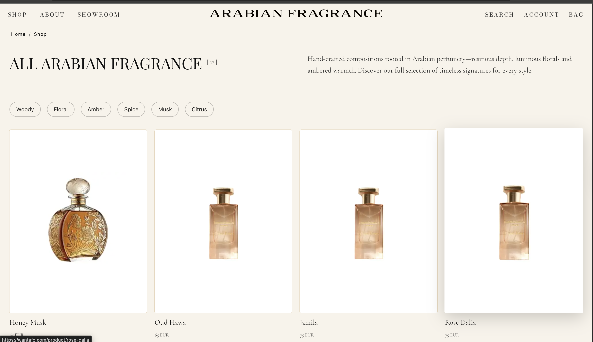
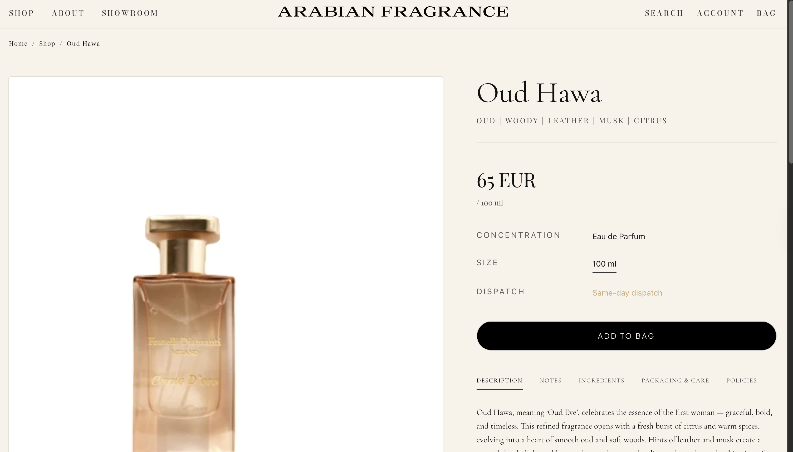

# Arabian Fragrance - Headless E-commerce Architecture

> **NOTICE:**
> This repository contains the source code for a live production application ([wantafc.com](https://wantafc.com)).
> It allows you to review the coding style, project structure, and architectural decisions.
>
> **Access Level:** Public (Portfolio Mode).
> **Permissions:** Shared with explicit written authorization from the client.
> **Restrictions:** Cloning, modifying, or using this code for commercial purposes is strictly prohibited.

## 🚀 Project Overview

**Arabian Fragrance** is a bespoke headless storefront built from scratch for a luxury perfume brand.
The project utilizes **Next.js 14** for the frontend and **Shopify's Storefront API** as the backend service, decoupled completely from standard Shopify themes to ensure maximum performance and design flexibility.

* **Live Deployment:** [https://wantafc.com](https://wantafc.com)
* **Status:** Production

## 🛠 Tech Stack

* **Frontend:** Next.js 14 (App Router, Server Components).
* **Language:** TypeScript.
* **Backend:** Shopify Plus (Headless via GraphQL).
* **Styling:** Tailwind CSS.
* **State Management:** React Context (Cart) + URL Search Params (Filtering).

## 📂 Implementation Details

This repository demonstrates the following technical implementations:

### 1. Shopify GraphQL Integration
A custom, type-safe fetcher was built to communicate directly with the Shopify Storefront API, avoiding heavy SDKs.
* **Location:** `lib/shopify/index.ts`

### 2. Dynamic Filtering System
The shop page features a filtering engine that reads Product Metafields (e.g., Olfactory Notes, Gender) and maps them to URL Search Params without page reloads.
* **Location:** `app/shop/page.tsx`

### 3. Cart & Checkout Synchronization
A persistent Cart Provider manages the basket state locally and synchronizes with Shopify to validate stock levels before redirecting the user to the native Shopify Checkout for payment.
* **Location:** `components/cart/CartView.tsx`

## 📸 Interface Previews

### Shop Grid & Filtering

### Product Detail Page (RSC)

## ⚖️ License

**Copyright (c) 2026 Arabian Fragrance.** All rights reserved.

The contents of this repository are the property of Arabian Fragrance. This code is publicly accessible for the sole purpose of portfolio review. Any use, reproduction, modification, or distribution is strictly prohibited.